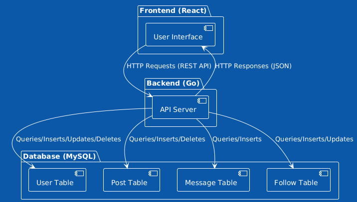

# social-network

Iniciei este projeto enquanto estudava as relações entre tabelas em bancos de dados estruturados. Construí um banco de dados no MySQL Workbench com a intenção inicial de criar uma simples estrutura de tabelas para uma rede social. No entanto, decidi expandir o projeto adicionando um servidor monolítico.

Escolhi a linguagem Go para construir o servidor, pois já estava familiarizado com sua sintaxe e sabia que ela oferecia simplicidade e desempenho na criação de APIs. Utilizei o Gin Web Framework para a construção da API. Meu próximo passo foi adicionar uma interface para a rede social e integrá-la ao backend. Para a construção da interface, utilizei a biblioteca React.

Durante o desenvolvimento do projeto, pude compreender melhor o funcionamento de um software na parte do servidor, da interface e como ele pode realizar a comunicação entre essas duas camadas.

## Arquitetura da aplicação
A Aplicação está dividida em três camadas que são:

- Frontend (React): Interage com o usuário final e envia requisições HTTP para o backend.
- Backend (Go): Recebe e processa as requisições do frontend, interage com o banco de dados e retorna os dados ou ações necessárias.
- Banco de dados (MySQL): Armazena as informações da rede social, incluindo usuários, postagens, mensagens e follows.

## Serviços
- Cadastro e Login de usuários
- Senhas criptografadas
- Autenticação JWT
- Middleware para proteção das rotas autenticadas
- Criaçaão de postagens de texto
- Feed de exibição dos posts dos usuários seguidos
- Página de perfil que exibe o icon, nome, username, posts, número de posts etc
- Edição do perfil
- Seguir outros usários
- Trocas de mensagens em tempo real

