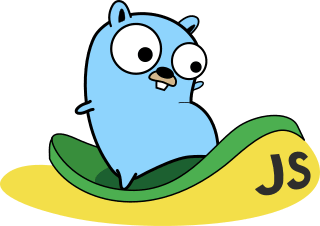

# Social Network Project

## Description

I began this project while studying relationships between tables in structured databases. I built a database in MySQL Workbench with the initial intention of it being a simple table structure for a social network. However, I decided to expand the project by adding a server.

I chose the Go language to build the server because I was already familiar with it and knew it offered good performance in creating APIs. Specifically, I utilized the Gin framework in Go for its efficiency and ease of use in handling HTTP requests. During the project's development, I was able to grasp the practical concept of scalability provided by the Go language and Gin framework. As the application grew and new features were added, the server maintained its stable performance.

My next step was to integrate a client into the application, which may have been the most challenging part of the process. However, it was worth it as it made the application more user-friendly and allowed me to develop my skills in front-end development. For creating templates, I used HTML, CSS for styling, and JavaScript fetch for communication between the client and the server.

## Features
- User registration and login
- Password hashing
- Asynchronous email and username validation
- Session authentication
- Middleware for protecting non-authenticated routes
- Creating text posts
- Editing profile
- Following other users
- Feed displaying posts based on followed users

